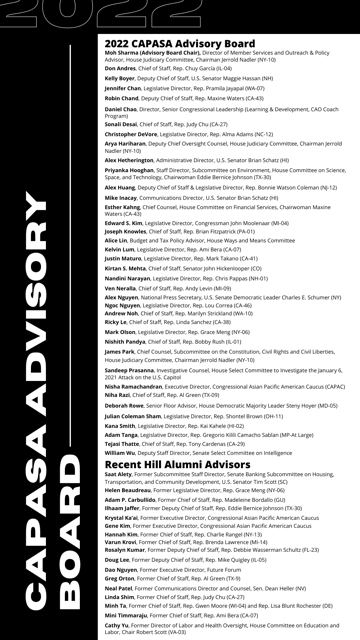

# Meet the 2023 CAPASA Executive Board

<table>
  <tr>
    <td>Co-Presidents</td>
    <td>Mo Elizano   Catalina Tam</td>
  </tr>
  <tr>
    <td>House Vice President</td>
    <td>James Kwon</td>
  </tr>
  <tr>
    <td>Senate Vice President</td>
    <td>[Vacant]</td>
  </tr>
  <tr>
    <td>Secretary</td>
    <td>Tony Tran</td>
  </tr>
  <tr>
    <td>Treasurer</td>
    <td>Kelvin Lum</td>
  </tr>
  <tr>
    <td>Communications Manager</td>
    <td>Christine Ho</td>
  </tr>
  <tr>
    <td>Professional Development Chair</td>
    <td>Jamie Hopkins</td>
  </tr>
  <tr>
    <td>Social and Cultural Chairs</td>
    <td>Casey Lee   Lucas Lam</td>
  </tr>
    <tr>
    <td>Menmbership Chair</td>
    <td>Benjamin Hong Starr</td>
  </tr>
    <td>Advisory Board Chair</td>
    <td>Moh Sharma</td>
  </tr>
</table>

# Meet the 202e CAPASA Advisory Board

